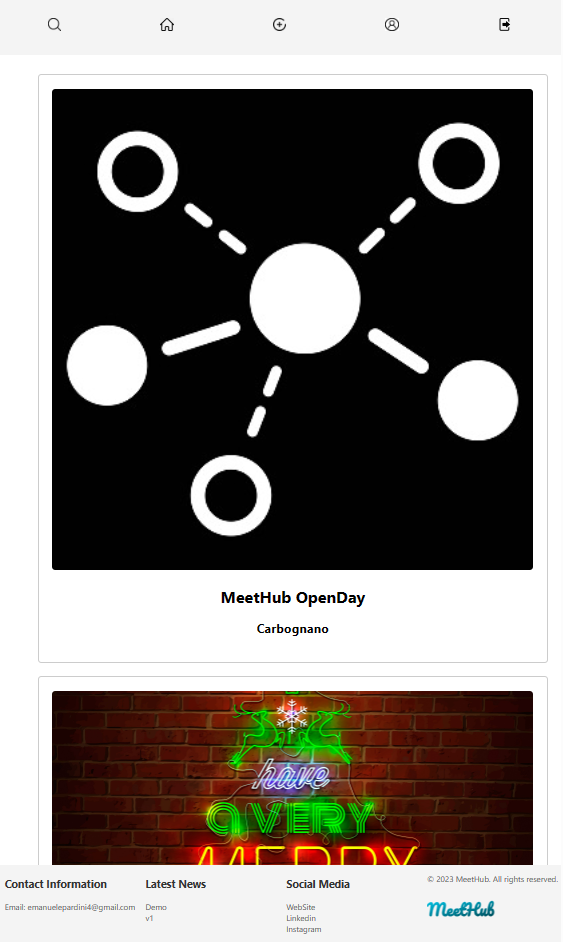

# MeetHub-Demo

## Description:
The first and opensource version of a social platform for sharing events made in PHP React

## Features:

- Register and login to see all the events around you  
- You can watch all the events from home, or filter by the events you joined in your personal area, or filter what you want to search for events to join!  
- You can add Events if you subscribe as a creator  
- Join events  
- See the event location  
- Chat with the users interested in on the event thread  

## How to Use:

1. Click login and then register  
2. Now watch or add events around you  
3. Join events and chat with users

## Project Setup:

0.Install Node, PHP, Composer   
1. Download the github repository  
2. Set up your .env files  
3. Enter the frontend dir and do npm install  
4. Enter the api dir and do the composer install  
5. Do npm start to use for the frontend  
6. Do php artisan serve for the backend
7. Execute the migration.sql on Mysql. 
8. Enjoy!  

## Technologies Used:
-React  
-Javascript  
-HTML  
-CSS  
-PHP  
-Laravel  
-MySQL  

## Author:

This web app was created by [Emanuele Pardini](http://emanuelepardini.altervista.org/).
Enjoy!
